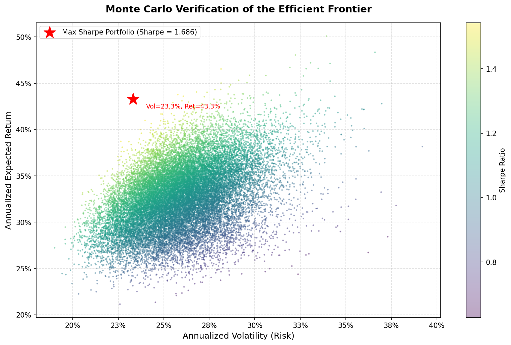

# Modern Portfolio Theory & Value at Risk Analysis

A Python implementation of MPT portfolio optimization and parametric VaR,
verified via Monte Carlo simulation.

## What it does
- Fetches 2 years of daily stock data via yfinance
- Optimizes portfolio weights to maximize the Sharpe Ratio (SLSQP)
- Computes 95% confidence 1-day parametric VaR
- Validates the result against 25,000 Monte Carlo simulations

## Stocks analyzed
AAPL, MSFT, GOOGL, NVDA, AMZN

## Key results
| Metric | Value |
|---|---|
| Max Sharpe Ratio | ~1.69 |
| Expected Annual Return | ~43.30% |
| 1-Day VaR (95%) | ~$22,438.61 |

## Setup
pip install -r requirements.txt
jupyter notebook MPT_VaR_Analysis.ipynb

## Concepts covered
- Log returns & annualization
- Covariance matrix (Σ) and expected return vector (μ)
- Markowitz Mean-Variance Optimization
- Variance-Covariance (parametric) VaR
- Monte Carlo simulation
